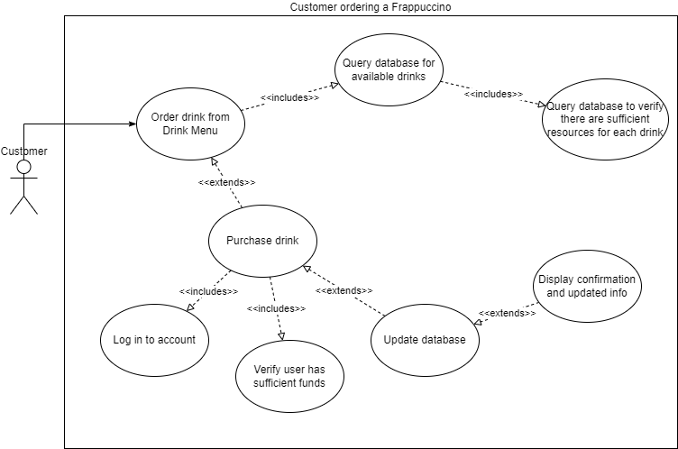
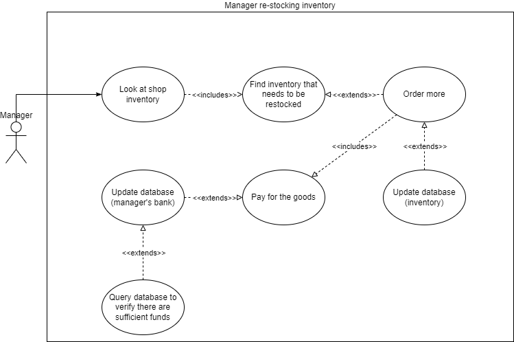
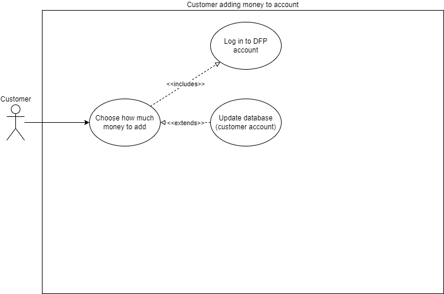
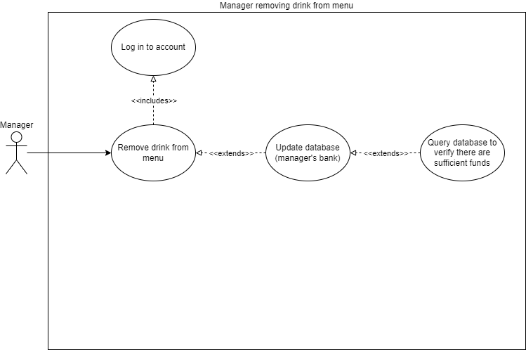
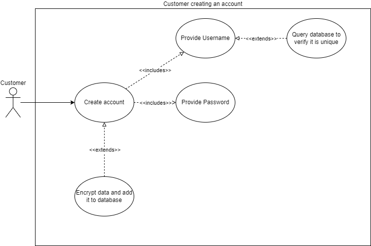

# Requirements Definition

### Introduction and Context

This application will include many essential functions for the success of Dan’s Frappuccino Paradise.  These functions include interfaces for customers, employees, and the shop manager to interact with the shop inventory, financials, and the selling of product.

Customers will be able to purchase their drinks online, or in the store so long as they have an account username and password.  They will also be able to browse preset options or customize their own menu items for easy ordering.

Employees will be able to charge customers and make purchases for them.  They will also be able to adjust shop inventory depending on the drinks that are sold.  Employees will also be responsible for tracking their work hours using this system.  Employees may also access any customer view so they too can enjoy the drinks that they sell.

Managers oversee the paying of employees for their recorded working hours, as well as keeping the shop inventories full.  A manager will also be able to edit any of the menu items to promote the sell of additional beverages.  The manager will also have access to any other views in case they need to cover for an employee, or if they also would like to purchase a drink from the store.

This will all be hosted from a web application for easy access.

### Users and their Goals

*This section contains identifies of the users of the proposed system and their goals, illustrated and supported by Use Case diagrams.   Here “users” is a board term that could include other software systems.*

The following UML use case diagrams will describe the system's actors and the actors' goals.

*Figure 1 - Customer orders Frappuccino*

Participating Actor: Customer

Entry Conditions:

    - Customer wants to purchase a drink.

Exit Conditions:

    - Customer order is fulfilled.
    - Customer decides not to order drink.

Event Flow:

1. Customer logs on to system.
2. Customer requests to view drink menu.
3. System displays available drinks.
4. Customer inputs their order.
5. System verifies customer has sufficient funds.
6. Customer pays for the drink.
7. System displays purchase confirmation and deducts items from inventory.

*Figure 2 - Employee updates timecard*

Participating Actor: Employee

Entry Conditions:

    - Employee wants to input the number of hours they've worked.

Exit Conditions:

    - Employee chooses not to input hours.
    - Employee's timecard is updated.

Event Flow:

1. Employee views area to update timecard.
2. Employee inputs hours worked.
3. System updates employee's total hours worked.

*Figure 3 - Manager pays employees*

Participating Actor: Manager

Entry Conditions:

    - Manager wants to pay employees based on hours worked.

Exit Conditions:

    - Employees are successfully paid.

Event Flow:

1. Manager views area where employees can be paid.
2. Manager pushes button to pay all employees.
3. Employee timecards are verified.
4. System ensures sufficient funds are available in manager's account.
5. System updates each employee's balance, and their timecard is reset to 0 hours.

*Figure 4 - Manager restocks inventory*

Participating Actor: Manager

Entry Conditions:

    - Manager wants to purchase additional inventory stock.

Exit Conditions:

    - Manager chooses not to restock.
    - Inventory is successfully restocked.

Event Flow:

1. Manager views inventory page.
2. Manager orders items to be restocked.
3. System ensures sufficient funds are available in the manager's balance.
4. Manager pays for items.
5. System updates inventory to include the purchased items

*Figure 5 - Manager adds new drink to menu*

Participating Actor: Manager

Entry Conditions:

    - Manager wants to add new menu item.

Exit Conditions:

    - Manager chooses not to add new item.
    - Drink is added to menu.

Event Flow:

1. Manager logs into their account.
2. Manager requests to add new drink to menu.
3. Manager sets cost, ingredients, and image for drink.
4. System verifies that ingredients listed are possible ingredients.
5. System adds drink to menu.

*Figure 6 - Customer adds money to their account*

Participating Actor: Customer

Entry Conditions:

    - Customer wants to update their account balance.

Exit Conditions:

    - Customer chooses not to add money.
    - Customer's balance is increased.

Event Flow:

1. Customer logs into their account.
2. Customer views field to input their desired amount to add.
3. Customer inputs desired amount.
4. System increases customer's balance by requested amount.

*Figure 7 - Manager removes item from menu*

Participating Actor: Manager

Entry Conditions:

    - Manager wants to remove item from menu.

Exit Conditions:

    - Manager chooses not to remove item.
    - Manager successfully removes item.

Event Flow:

1. Manager logs into their account.
2. Manager removes item from menu,
3. System updates menu to reflect removal of item.

*Figure 8 - Customer creates account*

Participating Actor: Customer

Entry Conditions:

    - Customer wants to create account.

Exit Conditions:

    - Customer chooses not to create account.
    - Customer account is successfully created.

Event Flow:

1. Customer navigates to account creation.
2. Customer inputs username and password.
3. System verifies that the input username is unique, has not been used by a previous customer.
4. System encrypts password and account information is added to database.

### Functional Requirements

<ol>
    <li>User Authentication and Access
        <ol>
            <li>The application must require all users to log in with a unique username and password before allowing them to have access to any views.</\li>
            <li>Members can have any of the following access levels: Customer, Employee, Manager
                <ol>
                    <li>item 1.2.1</li>
                    <li>item 1.2.2</li>
                </ol>
            </li>

        </ol>
    </li>
    <li>
</ol>

1. User Authentication and Access
   1. The application must require all users to log in with a unique username and password before allowing them to access any views.
   2. Members can have any of the following access levels: Customer, Employee, Manager
      1. Users with customer clearance should have access to all Customer Features (FR3)
      2. Users with employee clearance should have access to all Customer and Employee Features (FR3, FR4)
      3. Users with manager clearance should have access to all Features. (FR3, FR4, FR5)
2. User Profile Features
   1. Any user may modify their own password.
   2. No user may modify their username
   3. Any user except for the manager may delete their account.
   4. Managers are the only level of user that may modify the password or username of another account or delete another account.
   5. Users should be allowed to view and edit their account balance.
   6. No real money is required to increase funds in the account.
3. Customer Features
   1. The application will allow any customers to view and order menu items
   2. The application will allow any customer to create and save their own preferred beverages as “Favorites”.
      1. These “Favorites” will know any addons needed.
      2. Users may customize the names of these custom drinks.
   3. The customer can see orders that they have placed which have not been completed.
      4. The customer may cancel any orders that have not been completed.
4. Employee Profile Features
   1. Employees may place an order for a customer from their account when given a customer’s username.
   2. Employees can see what order needs to be completed next.
      1. Once an order is completed, and employee can mark the order as complete and remove it from the queue.
   3. Employees should be able to add to their total hours worked and view how many hours they have worked from the last paycheck.
5. Manager Profile Features
   1. A manager will be able to view and edit all menu items
   2. Managers will be able to see and increase stock by purchasing using money from their account.
      1. For the purposes of this assignment, the manager can set the price of ingredients.
   3. Managers will be able to see all employee work hours and one-click pay all at a fixed rate (>$15.00/hr)
   4. Managers will be able to edit access and remove employees.
   5. All income will enter the manager’s account and then be paid out for ingredients and employee pay.

### Non-functional Requirements

1. The application must use a database
   
   1. User account information will be stored, including the following: Username, password (encrypted), account balance, favorites, employee hours, account clearance.
   2. Shop information will be stored, including the following: Inventory, menu items.

2. The team will use Git for version control, with GitHub as a remote repository.

3. The application will be hosted via localhost.

### Future Features:

##### (Possible) Quick Order Function

Once a user orders the same drink 3+ times, or presses a "save order" button, a new option is added under their drop downs for options which will result in the exact settings as their saved drink.

##### (Possible) Inventory Smart Tracker

Based on last month of orders completed, will guess the required amount of materials needed for the next month. Prevents over ordering of drink supplies that are not being used often. Should work more as a trend viewing feature.

##### (Possible) Automatic Employee of the Month

Rewards the employee of the month automatically based on criteria for that month (I.E. Hours worked, orders taken, orders served, etc). Can reward a bonus like bonus pay or a featuring on the webpage.

***

### **Glossary**

This section contains a list of important terms and their definitions.

1. *Customer* – a user that uses the application to purchase beverages.
2. *Employee* – a user that uses the application to manage orders and their own timecard.
3. *Manager* – a user that uses the application to oversee stock and financial information.
4. *User* – any person that is authorized to use the application or has logged into the application.
5. *Favorite* – a customized beverage that has been stored by a user.
