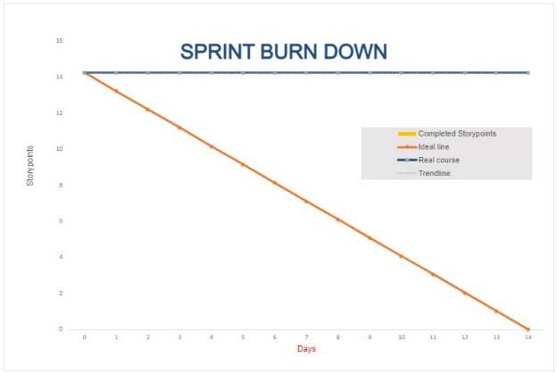

Sprint Planning 
## Know the end from the beginning
- When the sprint ends

October 17, 2022

- How many hours you have to work on this project this sprint

5 hours each team member

- Who is going to be here on what days (vacation / other class priorities)

Keldon – Tuesday, Thursday, Sunday

Noah – Tuesday, Thursday, Saturday

Zach – Tuesday, Thursday, Saturday, Sunday

Jensen – Any Day, out of town Friday Oct 7 to Sunday Oct 9

- Pick a metric to evaluate each other on during the retrospective

Amount of story points completed

- Assign a ScrumMaster for this sprint

Scrum Master – Keldon Boehmer

- List all team members on this document (indicate who was not here)
  - Keldon Boehmer
  - Noah Knight
  - Zach Harrison
  - Jensen Judkins (not here)
## Fill out details for each story
- Make sure all previous stories in the “Done” column are archived in your GitHub project
- Each story that you bring in has a description with:
  - Size estimate by the team
    - Small (< 1 day)
    - Medium (1 day)
    - Large (2 days)
    - Any larger than this should be broken down into smaller tasks
  - Description of what is in scope, what’s out of scope
  - Acceptance criteria in the description stating what it will look like when it’s done
  - Tasks that will be accomplished to complete the story
    - These tasks can be created in the GitHub project as notes (but then convert them to issues so that you can assign a person)
    - Assign a size estimate to each task (S, M, L)
- Stories and tasks should not be assigned to a specific person (unless carrying over from a previous sprint)
## Artifacts
- Stories / tasks are created and on the sprint backlog
- Create a spreadsheet graph for burndown by totaling up the size estimates and setting that as your amount of work left to do. (commit and push to /docs/planning/SprintXBurndown.xlsx)

**BURNDOWN CHART INCLUDED AS SCREENSHOT IN THIS DOCUMENT**

- Sprint planning document (with the top section information to /docs/planning/SprintX.docx)
  - Attach a screenshot of your Sprint Backlog after planning

**STORIES**

1 story point = 1 hour

Each individual task within a story is assigned a number, which is the agreed upon number of story points for that task after doing story point poker. The total sum of story points for each task makes up the story point count for the whole story.

User creation page

Upon completion, this page should allow a user to create an account by inputting a username and password each into a text field. Then the user should be created and stored in the database, with the password being encrypted by Django, and the encrypted password is associated with the user in the database, so that their true password is not stored anywhere.

`	`Tasks

`		`UI

`			`0.5

`		`Encryption

`			`0.25

`		`Store in Database

`			`0.5

`	`1.25 Story Points total

Log in Page

Upon completion, this page should display text fields that allow a user to input their username and password to log into the website. The username should be located in the database to determine that a user with the given username does exist, and their password should be passed through the Django encryption and verified that the encryptions match. If either the username does not exist, or the password does not match, an appropriate error message should be displayed. If the user info is correct, then the user should be logged into the website, and be redirected to a page indicating that they have been successfully logged in.	

`	`Tasks

`		`UI

`			`0.5

`		`Access User Info

`			`1.5

`		`Navigation after login

`			`0.5

`	`2.5 Story Points total

Populate and modify database

Upon completion, the Django database should be populated with at least 12 ingredients, and all the information that is associated with an ingredient. Additionally, the database should include at least 6 drinks, and all the information that is associated with a drink. The database should also be modified to combine the Customer, Employee, and Manager models into a single model in the database, and the Customer, Employee, and Manager models can exist as sub-models of the singular “User” model, taking advantage of polymorphism.

`	`Tasks

Ingredients

`			`1.0

`		`Drinks

`			`1.5

`		`Condense to one User Model

`			`1.0

`		`Create Orders Model

`			`0.5

`	`4.0 Story Points total

Drink Menu page

`	`Upon completion, this page should display each drink in the menu in a visually pleasing way.

`	`Tasks

`		`UI

`			`1.0

`		`Load drinks from database

`			`0.5

`	`1.5 Story Points total

Customer account page (change username, update balance)

Upon completion, this page should display a user’s information to them. This information should include their username, and their monetary balance. Each of these is associated with a button, to allow a user to change their username, and to allow the user to input an amount to increase their balance by.

`	`Tasks

UI

`			`0.25

`		`Functionality of database updates (username, balance)

`			`0.75

`	`1.0 Story Points total

Documentation

Upon completion, this document should be filled out, including a screenshot of the Github Project Board and the Burndown chart. Additionally, Writeups for each standup meeting should be completed.

Tasks

`		`Initial sprint planning information

`			`0.25

`		`Story filling sprint plan

`			`1.0

`		`Burndown chart

`			`1.0

`		`Github Project backlog

`			`0.75

`		`Standup meeting Writeups

`			`1.0

`	`4.0 Story Points total

