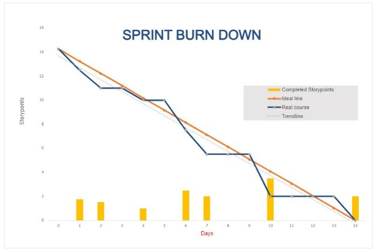

GROUP 10
# Sprint Retrospective
- During your retrospective, spend at least 10 minutes talking over:
  - What went well

Everything that was planned was completed. 

- What didn't go well

Minor edge case bugs

Difficulties researching technologies used (ex. Django)

- What specific things you can do to improve

Better explanation/description of our work when committing to Git.

Acknowledgement of completed work in Discord

Better Tracking of story points completed as individuals

- List the measurement criteria

Story points completed

- Assign a percentage to each team member based on your metric specified in this sprint's planning
- Each person should have a percent between 0-100%
- Total percent for the team should be 100%

Keldon Boehmer – 28%

Zach Harrison – 21%

Jensen Judkins – 26%

Noah Knight – 25%

- Include the scrum master, and all of the members of the group (marking those who are present).

Keldon Boehmer – Scrum Master

Zach Harrison

Jensen Judkins

Noah Knight

