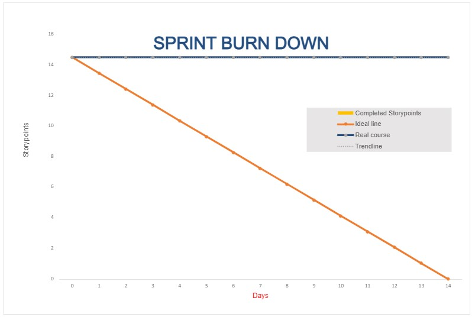

Sprint Planning 
## Know the end from the beginning
- When the sprint ends

October 31, 2022

- How many hours you have to work on this project this sprint

5 hours each team member

- Who is going to be here on what days (vacation / other class priorities)

Keldon – Tuesday, Thursday, Sunday

Noah – Tuesday, Thursday, Saturday

Zach – Tuesday, Thursday, Saturday, Sunday

Jensen – Any Day

- Pick a metric to evaluate each other on during the retrospective

Amount of story points completed

- Assign a ScrumMaster for this sprint

Scrum Master – Keldon Boehmer

- List all team members on this document (indicate who was not here)
  - Keldon Boehmer
  - Noah Knight
  - Zach Harrison
  - Jensen Judkins
## Fill out details for each story
- Make sure all previous stories in the “Done” column are archived in your GitHub project
- Each story that you bring in has a description with:
  - Size estimate by the team
    - Small (< 1 day)
    - Medium (1 day)
    - Large (2 days)
    - Any larger than this should be broken down into smaller tasks
  - Description of what is in scope, what’s out of scope
  - Acceptance criteria in the description stating what it will look like when it’s done
  - Tasks that will be accomplished to complete the story
    - These tasks can be created in the GitHub project as notes (but then convert them to issues so that you can assign a person)
    - Assign a size estimate to each task (S, M, L)
- Stories and tasks should not be assigned to a specific person (unless carrying over from a previous sprint)
## Artifacts
- Stories / tasks are created and on the sprint backlog
- Create a spreadsheet graph for burndown by totaling up the size estimates and setting that as your amount of work left to do. (commit and push to /docs/planning/SprintXBurndown.xlsx)

**BURNDOWN CHART INCLUDED AS SCREENSHOT IN THIS DOCUMENT**

- Sprint planning document (with the top section information to /docs/planning/SprintX.docx)
  - Attach a screenshot of your Sprint Backlog after planning

**STORIES**

1 story point = 1 hour

Each individual task within a story is assigned a number, which is the agreed upon number of story points for that task after doing story point poker. The total sum of story points for each task makes up the story point count for the whole story.

Documentation

    - Upon completion, this document should be filled out, including a screenshot of the Github Project Board and the Burndown chart. Additionally, Writeups for each standup meeting should be completed.

    - Tasks

        -Initial sprint planning information

            -0.25

        -Story filling sprint plan

            -1.0

        -Burndown chart

            -1.0

        -Github Project backlog

            -0.75

        -Standup meeting Writeups

            -1.0

    -4.0 Story Points total

Ingredients/Stock page

    -Upon completion, the page where a manager can view the list of ingredients and their amount in stock should be functioning. Each ingredient should be listed, alongside their current stock, and a text field where a manager can enter a number for each ingredient. Upon pressing a button, the stock of each ingredient is increased by the amount entered into the text field. The total price to update the stock should also be deducted from the manager’s account.

    -Tasks

        -UI

            -0.75

        -Load ingredients from database

            -0.25

        -Update stock of ingredients

            -0.75
    
    1.75 Story Points total

Individual Drink Order Page

    -Upon completion, a page where a customer can view and order a specific drink should be completed. There should be a list of ingredients in the drink, where the customer can increase or decrease the amount of each ingredient in the drink. The customer can then click a button to submit the order, which adds the drink to the list of orders, deducts the drink’s price from the customer’s balance, and deducts the amount of ingredients used from said ingredient’s stock.

    -Tasks

        -UI

            -0.75

        -Load drink info/other ingredients

            -0.5

        -Customer submits order

            -1.5

    -2.75 Story Points total

Orders List Page

    -Upon completion, this page should allow an employee to view all currently available orders, each having a button that can fulfill said order. When an employee fulfills an order, the order should be removed from the database.

    -Tasks

        -UI

            -0.75

        -Load orders from database

            -0.5

        -Employee fulfills order

            -0.5

    -1.75 Story Points total

Merge Pages
    
    -Upon completion, all pages that are currently distinct for each user type (manager, employee, customer) should be condensed into one page of each type for each user. If a page is exclusively for a specific user type, that page should only be accessible by said user type. Any features within a universal page that are only available to a specific user type should also only be available to said user type.

    -Tasks

        -UI

Manager Privileges

    -Upon completion, actions that can be taken by a manager should be implemented, and should only be available on a manager’s account page. These methods include hiring/firing an employee, which promotes them from a customer, or demotes them to a customer respectively. Another method is paying all employees, which resets all employees hours worked to 0, and adds the proper amount to their balance (including extra pay for over time). This money should be deducted from the manager’s balance.

    -Tasks

        -UI

            -0.5

        -Hire / Fire Employee methods

            -0.75

        -Pay Employees method

            -0.75
    
    -2.0 Story Points total

