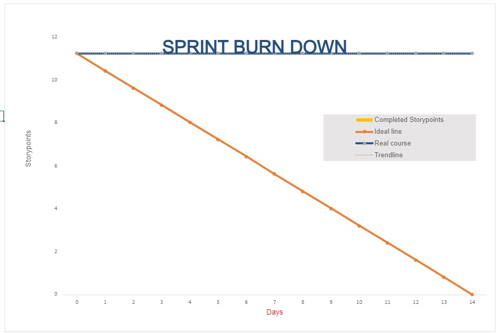
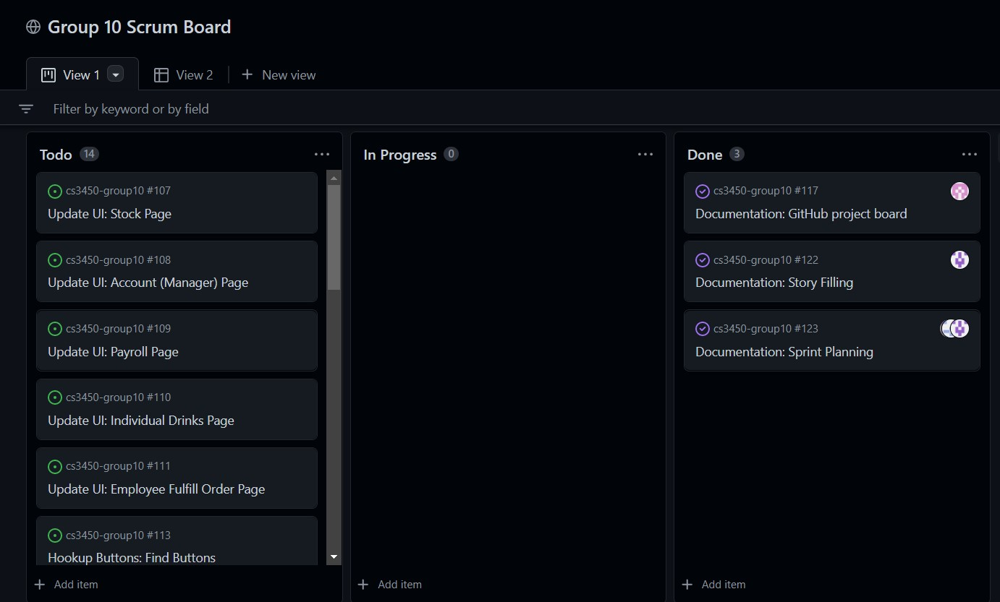

Sprint Planning 

## Know the end from the beginning

- When the sprint ends

November 14, 2022

- How many hours you have to work on this project this sprint

5 hours each team member

- Who is going to be here on what days (vacation / other class priorities)

Keldon – Tuesday, Thursday, Sunday

Noah – Tuesday, Thursday, Saturday

Zach – Tuesday, Thursday, Saturday, Sunday

Jensen – Any Day

- Pick a metric to evaluate each other on during the retrospective

Amount of story points completed

- Assign a ScrumMaster for this sprint

Scrum Master – Keldon Boehmer

- List all team members on this document (indicate who was not here)
  
  - Keldon Boehmer
  
  - Noah Knight
  
  - Zach Harrison
  
  - Jensen Judkins (not present)
    
    ## Fill out details for each story

- Make sure all previous stories in the “Done” column are archived in your GitHub project

- Each story that you bring in has a description with:
  
  - Size estimate by the team
    - Small (< 1 day)
    - Medium (1 day)
    - Large (2 days)
    - Any larger than this should be broken down into smaller tasks
  - Description of what is in scope, what’s out of scope
  - Acceptance criteria in the description stating what it will look like when it’s done
  - Tasks that will be accomplished to complete the story
    - These tasks can be created in the GitHub project as notes (but then convert them to issues so that you can assign a person)
    - Assign a size estimate to each task (S, M, L)

- Stories and tasks should not be assigned to a specific person (unless carrying over from a previous sprint)
  
  ## Artifacts

- Stories / tasks are created and on the sprint backlog

- Create a spreadsheet graph for burndown by totaling up the size estimates and setting that as your amount of work left to do. (commit and push to /docs/planning/SprintXBurndown.xlsx)

**BURNDOWN CHART INCLUDED AS SCREENSHOT IN THIS DOCUMENT**

- Sprint planning document (with the top section information to /docs/planning/SprintX.docx)
  - Attach a screenshot of your Sprint Backlog after planning

**STORIES**

1 story point = 1 hour

Each individual task within a story is assigned a number, which is the agreed upon number of story points for that task after doing story point poker. The total sum of story points for each task makes up the story point count for the whole story.

Documentation

    - Upon completion, this document should be filled out, including a screenshot of the Github Project Board and the Burndown chart. Additionally, Writeups for each standup meeting should be completed.
    
    - Tasks
    
        -Initial sprint planning information
    
            -0.25
    
        -Story filling sprint plan
    
            -1.0
    
        -Burndown chart
    
            -1.0
    
        -Github Project backlog
    
            -0.75
    
        -Standup meeting Writeups
    
            -1.0
    
    -4.0 Story Points total

Make UI prettier

        - Upon completion, the UI on all pages for the website should be formatted better (ex. using HTML tables) and generally be easier to understand and navigate while also being aesthetically pleasing.
    
        - Tasks
    
            -Stock Page
    
                -0.75
    
            -Account Page (Manager)
    
                -0.25
    
            -Payroll Page
    
                -0.25
    
            -Individual Drink Page
    
                -0.25
    
            -Employee Fulfill Order Page
    
                -0.5
    
            -Menu Page
    
                -0.25
    
        - 2.25 Story Points total

Hook up Buttons

       -Upon completion, the buttons on the UI should all execute the appropriate methods. (ex. the hire employee button should execute the method that hires an employee)
    
       -Tasks
    
            -List all buttons that need hooking up
    
                -0.5
    
            -Buttons execute methods, view function edited
    
                -1.0
    
      - 1.5 Story Points total           

Testing

       - Upon completion, all bugs found via unit testing should be fixed, and the website should properly function from the user's perspective. Any testing results should also be documented.
    
       -Tasks
    
            - Writing Unit Tests
    
                -1.0
    
            - Running Unit Tests / Fixing bugs
    
                -1.0
    
            - Front End display
    
                -0.5
    
            -Documentation
    
                -0.25
    
    
       - 2.75 Story Points total

Code Cleanup

      - Upon completion, any unused/unnecessary code should be removed, and any code left should include comments explaining anything that could be vague.
    
      -Tasks
    
            - Delete Unused code
    
                -0.25
    
            - Comments in code
    
                -0.5
    
      -0.75 Story Points total

