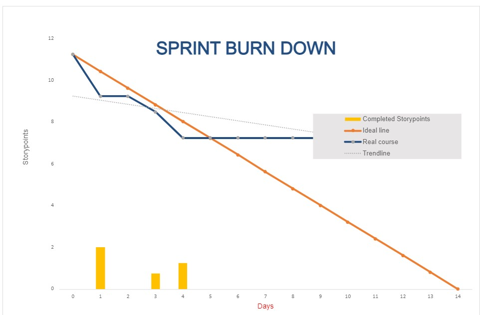

**Daily Scrum or Standup Meeting**

Team name: Group 10

Scrum Master: Keldon Boehmer

Date: 

| **Team Member**                                          | **What did you do since the last scrum?**                            | **What do you plan to do before the next scrum?**                                     | **What obstacles do you have?** |
|:-------------------------------------------------------- |:-------------------------------------------------------------------- |:------------------------------------------------------------------------------------- |:------------------------------- |
| 

Keldon Boehmer

 | Filled the remainder of the sprint planning document                 | Delete unused code                                                                    | Other classes                   |
| 

Zach Harrison

  | 
Github Project Board

Burndown charts
                    | Create list of buttons to be hooked up                                                | Other classes                   |
| 

Jensen Judkins

 | 
Wrote unit tests

Documentation for executing unit tests
 | 
Clean up README

Hook up buttons
                                          | Swim meet over the weekend      |
| 

Noah Knight

    | Cleaned up UI on most pages                                          | Stock page and Individual drink page needs to update price based on increase/decrease | Gone Sunday                     |
| 

               |                                                                      |                                                                                       |                                 |

# Burndown

# Screenshot of you project board

