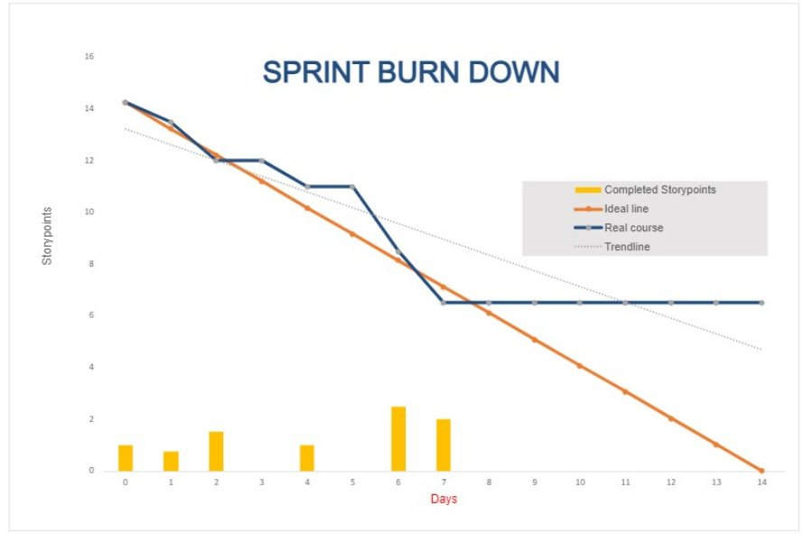

**Daily Scrum or Standup Meeting**

Team name: Group 10

Scrum Master: Keldon Boehmer

Date: 10/11/2022

|**Team Member**|**What did you do since the last scrum?**|**What do you plan to do before the next scrum?**|**What obstacles do you have?**|
| :- | :- | :- | :- |
|

Keldon Boehmer

|Populated Database with drinks and ingredients|Review work done by others.|
Other classes

|
|

Zach Harrison

|Merged customer/employee/manager models into one user model. Created orders model.|Burndown chart|Other classes|
|

Jensen Judkins

|Attempted user creation unit tests.|Ensure login functionality is retained during site navigation. Continue work on unit test.|CSRV token created in python profile|
|

Noah Knight

|Register/login page UI |Correct navigation from login page|Work|
|

||||
# Burndown

# Screenshot of you project board

