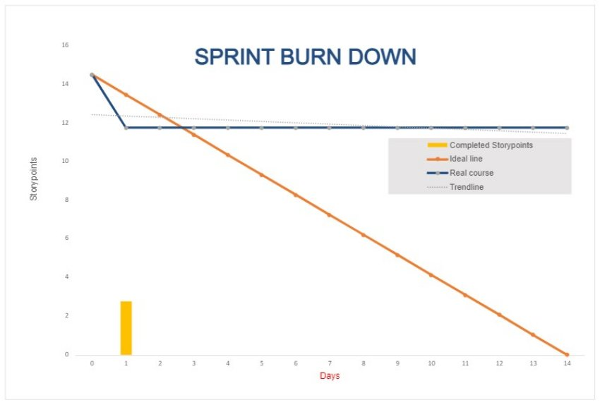

**Daily Scrum or Standup Meeting**

Team name: Group 10

Scrum Master: Keldon Boehmer

Date: 10/20/22

|**Team Member**|**What did you do since the last scrum?**|**What do you plan to do before the next scrum?**|**What obstacles do you have?**|
| :- | :- | :- | :- |
|

Keldon Boehmer

|Story Description writeups, conversion of docx files to md files|Implement the pay employees method|Gone for weekend|
|

Zach Harrison

|Github Project Board, Burndown Chart started|Loading orders and individual drinks from database|Research needed to complete assigned tasks|
|

Jensen Judkins

|Not at meeting|Not at meeting|Not at meeting|
|

Noah Knight

|Planning page merge|Merge pages, work on other UI|Not available Saturday afternoon|
|

||||
# Burndown

# Screenshot of you project board

