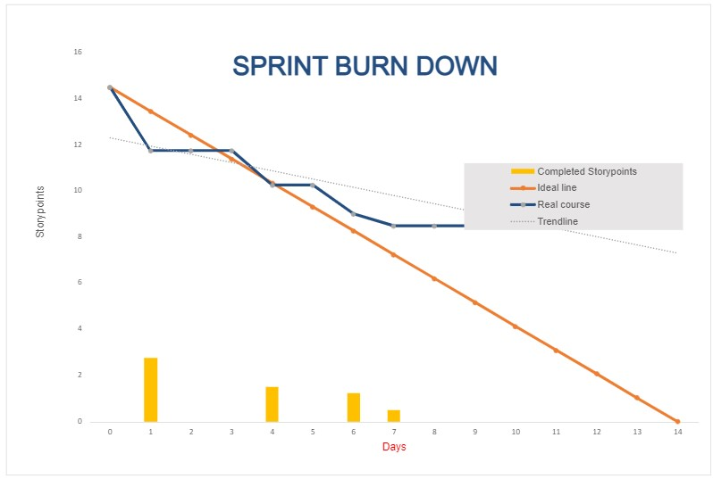

**Daily Scrum or Standup Meeting**

Team name: Group 10

Scrum Master: Keldon Boehmer

Date: 10/25/22

| **Team Member**                                          | **What did you do since the last scrum?**      | **What do you plan to do before the next scrum?**                                                  | **What obstacles do you have?** |
|:-------------------------------------------------------- |:---------------------------------------------- |:-------------------------------------------------------------------------------------------------- |:------------------------------- |
| 

Keldon Boehmer

 | Fulfill order and add ingredient stock methods | Pay employees and Hire/fire employee                                                               | N/A                             |
| 

Zach Harrison

  | Not at meeting                                 | Not at meeting                                                                                     | Not at meeting                  |
| 

Jensen Judkins

 | Not at meeting                                 | Not at meeting                                                                                     | Not at meeting                  |
| 

Noah Knight

    | Merged pages, basic UI for ingredients page    | Finish rest of UI, start polishing, fix account page so that adding money does not change the page | Catching up on sleep            |
| 

               |                                                |                                                                                                    |                                 |

# Burndown

# Screenshot of you project board

