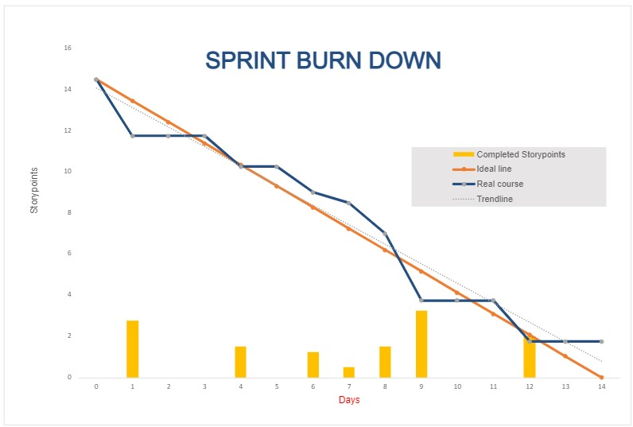

**Daily Scrum or Standup Meeting**

Team name: Group 10

Scrum Master: Keldon Boehmer

Date: 10/27/22

| **Team Member**                                          | **What did you do since the last scrum?**                                       | **What do you plan to do before the next scrum?** | **What obstacles do you have?**    |
|:-------------------------------------------------------- |:------------------------------------------------------------------------------- |:------------------------------------------------- |:---------------------------------- |
| 

Keldon Boehmer

 | Implemented hire/fire/pay employees methods                                     | Submit order method                               | 
Weekend

Other classes
 |
| 

Zach Harrison

  | N/A                                                                             | Burndown charts, load individual drinks           | Sickness                           |
| 

Jensen Judkins

 | Not at meeting                                                                  | Not at meeting                                    | Not at meeting                     |
| 

Noah Knight

    | Fixed bug with navigation to wrong page, implemented hire/fire employee buttons | UI for individual drink page                      | Weekend                            |
| 

               |                                                                                 |                                                   |                                    |

# Burndown

# Screenshot of you project board

