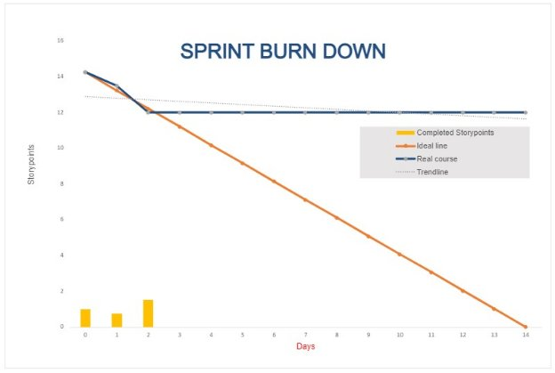

**Daily Scrum or Standup Meeting**

Team name: Group 10

Scrum Master: Keldon Boehmer

Date: 10/6/2022

|**Team Member**|**What did you do since the last scrum?**|**What do you plan to do before the next scrum?**|**What obstacles do you have?**|
| :- | :- | :- | :- |
|

Keldon

Boehmer

|Completed Sprint Planning meeting document.|Populate database with drinks and ingredients. Create orders model in database.|
Weekend plans

Other classes
|
|

Zach

Harrison

|Posted tasks to Github project board with descriptions.|Merge user models to user superclass model.|Other classes|
|

Jensen

Judkins

|Added functionality to create user and allow user to login. |Research permissions for different user types. Create unit test to test user creation.|
Student athlete weekend trip. 

Models need to be merged before permissions can be implemented.
|
|

Noah

Knight

|Mapping and forming UI ideas.|
Login and user creation page UI set up.

Set up navigation after models merge.

Menu page UI
|
Models need to be merged.

Drinks and ingredients have been added to database.
|
|

||||
#
#
# Burndown

# Screenshot of you project board

